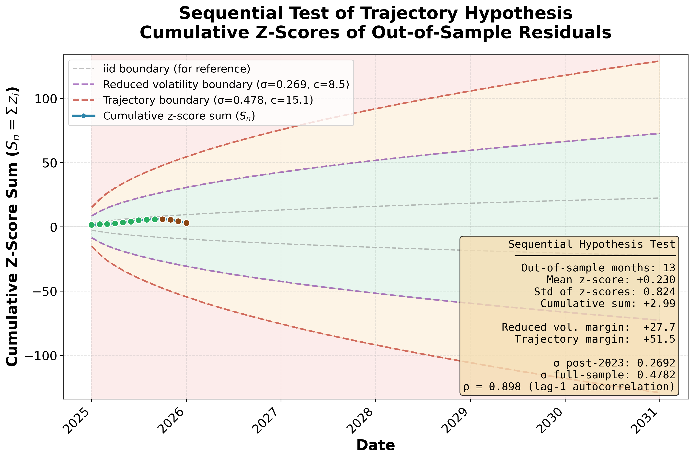

# Model Scorecard

Sequential test of the trajectory and reduced volatility hypotheses from [Bitcoin's Gold Price: History, Model, and Falsifiable Predictions through 2035](https://papers.ssrn.com/sol3/papers.cfm?abstract_id=5110528).

This scorecard tracks the cumulative z-score of out-of-sample monthly observations against the model's predictions. See Section 10 of the paper for methodology.

## Current Status

**Last updated:** February 2026

| Metric | Value |
|--------|-------|
| Out-of-sample months | 14 |
| Cumulative z-score (S_n) | +0.93 |
| Reduced volatility margin | +27.7 |
| Trajectory margin | +51.5 |
| Status | Green (both hypotheses supported) |

## Zone Definitions

- **Green:** Both trajectory and reduced volatility hypotheses supported
- **Yellow:** Reduced volatility hypothesis rejected, trajectory intact
- **Red:** Both hypotheses rejected

## Latest Figure

## Rejection Thresholds

At a sustained ratio of 13 oz Gold/BTC:
- Reduced volatility boundary: ~15 months
- Trajectory boundary: ~32 months

At 8 oz: trajectory rejection in ~18 months. At 5 oz: ~12 months.

## History

| Date | S_n | Status | BTC/Gold (oz) | Notes |
|------|-----|--------|---------------|-------|
| 2026-02 | +0.93 | Green | ~13 | Initial scorecard; bust phase in progress |
